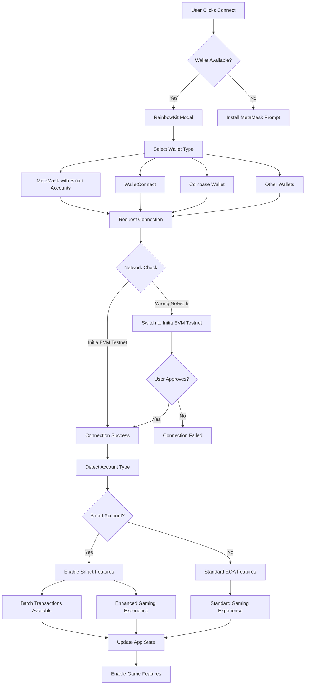
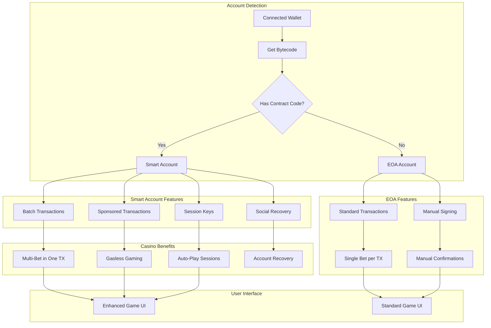
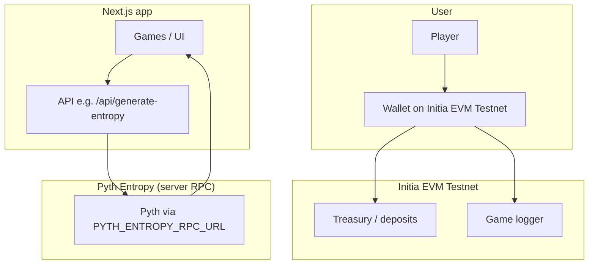
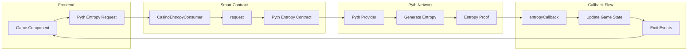
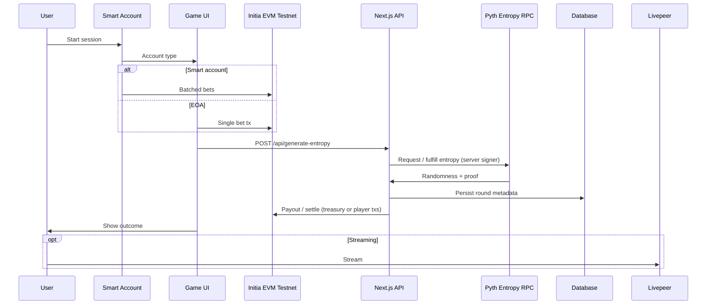
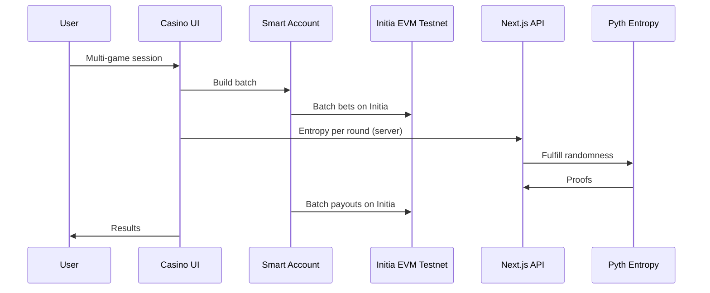

# APT Casino

- **Repository:** [https://github.com/0xamaan-dev/APT-CASINO](https://github.com/0xamaan-dev/APT-CASINO)
- **Live app (Vercel):** [https://apt-casino-initia-chi.vercel.app](https://apt-casino-initia-chi.vercel.app)
- **Demo video (YouTube):** [https://youtu.be/hkBWR4cIVak](https://youtu.be/hkBWR4cIVak)
- **Pitch deck (Figma):** [APT Casino — Initia](https://www.figma.com/deck/MaNXzpdQG9Xu00r9LHuT1w/APT-Casino-Initia?node-id=1-1812&p=f&t=lw2ZfabwT0TwgRfK-1&scaling=min-zoom&content-scaling=fixed&page-id=0%3A1)

## Initia

- **Project Name**: APT Casino

### Testnets

APT Casino runs against **Initia public testnets** (not mainnet):

- **Initia EVM testnet — `evm-1`** — Primary network for APT Casino ([Initia Scan — evm-1](https://scan.testnet.initia.xyz/evm-1)). Casino games, **wagmi** wallet flows, game logger, NFTs, and deposit/withdraw INIT all run on this EVM testnet.
- **Treasury account on Scan** — [treasury EOA (evm-1)](https://scan.testnet.initia.xyz/evm-1/accounts/0x6E932AD4F0E99E0e49059149C035194cc352BE52/overview).

### Project Overview

APT Casino is a provably fair, Initia casino: players connect with InterwovenKit-compatible wallets, play multiple games, and have rounds logged on-chain. The app targets web3 users who want transparent randomness (Pyth Entropy for server-side draws) and verifiable game history on **Initia EVM testnet `evm-1`**, with treasury-backed UX for deposits and play.

### Implementation Detail

- **The Custom Implementation**: Game logic, UI, and APIs for roulette, mines, wheel, and plinko; on-chain **EVM** game logger (`InitiaGameLogger`); NFT metadata route; Supabase-backed history; server-side Pyth Entropy requests; and treasury/deposit/withdraw flows tailored to Initia testnet.
- **The Native Feature**: **`auto-signing`** via **InterwovenKit** (`@initia/interwovenkit-react`). The app wraps the tree in `InterwovenKitProvider` (TESTNET) with `enableAutoSign`, uses **`initiaPrivyWalletConnector`** together with **injected** and **MetaMask** in wagmi, and exposes **`InitiaAutoSignControls`** in the navbar. EVM casino transactions run on **Initia EVM testnet `evm-1`** (chain id `2124225178762456`).

**Integration path (as implemented):**

1. **`src/components/WalletProviders.js`** — `WagmiProvider` + `createConfig` with `[initiaPrivyWalletConnector, injected(), metaMask()]`; `InterwovenKitProvider` spread `{...TESTNET}` and `enableAutoSign`; `injectStyles(InterwovenKitStyles)` on mount; existing network guard unchanged for EVM.
2. **`src/components/InitiaAutoSignControls.jsx`** — `useInterwovenKit().autoSign` to `enable` / `disable` on `TESTNET.defaultChainId` with wallet UX aligned to `evm-1` flows.
3. **Why auto-signing for a casino** — High-frequency play matches the BlockForge / auto-signing blueprint intent: fewer interruptive wallet prompts for whitelisted Initia message flows while EVM game contracts stay on the Initia EVM RPC you configure in `.env`.

### How to Run Locally

1. `git clone https://github.com/0xamaan-dev/APT-CASINO.git && cd APT-CASINO`
2. `yarn` or `npm install`
3. `cp .env.example .env` and fill in Supabase, WalletConnect, Initia RPC, treasury keys, and Pyth entropy settings (see `.env.example` comments). Do not commit `.env`.
4. `yarn dev` or `npm run dev` and open [http://localhost:3000](http://localhost:3000) — connect a browser wallet, switch to **Initia EVM Testnet** if prompted, and use the **Initia auto-sign** control in the navbar after connecting.

A couple of days back, I was was on etherscan exploring some transactions and saw an advertisement of https://stake.com/ which was giving 200% bonus on first deposit, I deposited 120 USDT into stake.com they gave 360 USDT as total balance in their controlled custodial wallet and when I started playing casino games I was shocked to see that I was only able to play with $1 per game and was unable to increase the betting amount beyond $1 and when I tried to explore and play other games on the platform the issue was persisting, I reached the customer support and got to know that this platform has cheated me under the name of wager limits as I was using the bonus scheme of 200%.

When I asked the customer support for refund they showed a mathematical equation which says if refund then I have to play $12,300 worth of gameplay and this was a big shock for me. Thereby, In the hope of getting the deposited money back, I played the different games of stake.com like roulette, mines, spin wheel, etc, the entire night and lost all the money and time.

I was very annoyed of that's how Apt-Casino was born, gamblefi all in one platform where new web3 users can play games, perform gambling but have a safe, secure, transparent environment that does not scam any of their users. Also, I wanted to address common issues in traditional gambling platforms.

## 🎯 The Problem

The traditional online gambling industry suffers from several issues:

- **Unfair Game Outcomes**: 99% of platforms manipulate game results, leading to unfair play
- **High Fees**: Exorbitant charges for deposits, withdrawals, and gameplay
- **Restrictive Withdrawal Policies**: Conditions that prevent users from accessing their funds
- **Misleading Bonus Schemes**: Trapping users with unrealistic wagering requirements
- **Lack of True Asset Ownership**: Centralized control over user funds
- **User Adoption Barriers**: Complexity of using wallets creates friction for web2 users
- **No Social Layer**: Lack of live streaming, community chat, and collaborative experiences

## 💡 Our Solution

APT Casino addresses these problems by offering:
- **Provably Fair Gaming**: All game outcomes are verifiably fair on-chain, not only by its developers but can be verified by the gambler themselves.


- **Multiple Games**: Wheel, Roulette, Plinko, and Mines with verifiable outcomes
- **MetaMask Smart Accounts**: Enhanced wallet experience with batch transactions
- **Flexible Withdrawal**: Unrestricted access to funds
- **Transparent Bonuses**: Clear terms without hidden traps
- **True Asset Ownership**: Decentralized asset management
- **Live Streaming Integration**: Built with Livepeer, enabling real-time game streams and tournaments
- **On-Chain Chat**: Supabase + Socket.IO with wallet-signed messages for verifiable player communication
- **Gasless Gaming Experience**: Treasury-sponsored transactions for seamless web2-like experience

## 🌟 Key Features

### 1. Smart Account Integration

- **Batch Transactions**: Multiple bets in one transaction
- **Delegated Gaming**: Authorise AI agent strategies to play on your behalf
- **Lower Gas Costs**: Optimized for frequent players
- **Enhanced Security**: Smart contract-based accounts

### 2. Provably Fair Gaming


- **Pyth Entropy**: Cryptographically secure randomness
- **On-Chain Verification**: All game outcomes verifiable
- **Transparent Mechanics**: Open-source game logic

### 3. Network architecture

- **Primary chain**: **Initia EVM testnet `evm-1`** ([Initia Scan](https://scan.testnet.initia.xyz/evm-1)) for gameplay, treasury signing, and game logs.
- **Treasury on Scan**: [EVM account overview](https://scan.testnet.initia.xyz/evm-1/accounts/0x6E932AD4F0E99E0e49059149C035194cc352BE52/overview).
- **Game logger contract**: [Initia Scan — `InitiaGameLogger`](https://scan.testnet.initia.xyz/evm-1/evm-contracts/0xcB559740E47eed913fDa1fFCecAd0D694dfA6271) (`0xcB559740E47eed913fDa1fFCecAd0D694dfA6271`).
- **NFT collection**: [Initia Scan — NFT collection](https://scan.testnet.initia.xyz/evm-1/nft-collections/0x737165fE3834e07E0b053900BcE3C18Add9F2c7D) (`0x737165fE3834e07E0b053900BcE3C18Add9F2c7D`).
- **Randomness**: Pyth Entropy (server-side RPC configured with `PYTH_ENTROPY_RPC_URL` and `PYTH_ENTROPY_SIGNER_PRIVATE_KEY` in `.env`)

### 4. Game Selection

- **Roulette**: European roulette with Smart Account batch betting
- **Mines**: Strategic mine-sweeping with delegated pattern betting
- **Plinko**: Physics-based ball drop with auto-betting features
- **Wheel**: Classic spinning wheel with multiple risk levels

### 5. Social Features

- **Live Streaming**: Integrated with Livepeer for real-time game streams and tournaments
- **On-Chain Chat**: Real-time communication with wallet-signed messages
- **Player Profiles**: NFT-based profiles with gaming history and achievements
- **Community Events**: Tournaments and collaborative gaming experiences

### 6. Web2 User Experience

- **Gasless Transactions**: Treasury-sponsored transactions eliminate gas fees
- **Seamless Onboarding**: Simplified wallet experience for web2 users
- **Familiar Interface**: Web2-like experience with web3 benefits

## 🚀 Getting Started

1. **Connect Wallet**: Connect MetaMask (or another injected wallet) on **Initia EVM Testnet**
2. **Get Tokens**: Get **INIT** on Initia EVM Testnet from the [Initia faucet](https://initia.xyz) (or your team’s funded test wallet)
3. **Deposit**: Deposit INIT (or supported ERC-20s) to your in-app casino balance via the treasury flow
4. **Play**: Start playing provably fair games without any txn confirmation requirement!

### Network configuration (wallet)

Add **Initia EVM testnet (`evm-1`)** to your wallet for casino transactions (values match `.env.example`).

- **Network name**: Initia EVM Testnet (Anvil)
- **RPC URL**: `NEXT_PUBLIC_INITIA_TESTNET_RPC` from `.env`
- **Chain ID**: `2124225178762456` (decimal; same as `NEXT_PUBLIC_INITIA_TESTNET_CHAIN_ID`)
- **Currency symbol**: INIT
- **Block explorer**: `NEXT_PUBLIC_INITIA_TESTNET_EXPLORER`

**Note:** Pyth Entropy runs on a separate RPC configured server-side (`PYTH_ENTROPY_RPC_URL`). Players stay on Initia in the wallet UI.

### Quick Setup

```bash
# Clone the repository
git clone https://github.com/0xamaan-dev/APT-CASINO.git
cd APT-CASINO

# Install dependencies
npm install

# Set up environment variables
# Create a .env file in the root directory
# Copy the environment variables from the "Environment Variables" section below
# ⚠️ IMPORTANT: Never commit your .env file to version control!

# Run development server
npm run dev
```

Visit `http://localhost:3000` for local development, or the live deployment at [https://apt-casino-initia-chi.vercel.app](https://apt-casino-initia-chi.vercel.app).

**Note:** Make sure to configure all required environment variables in your `.env` file before running the application. See the [Environment Variables](#environment-variables) section for the complete configuration.

## 🔷 Smart Account Features

APT Casino leverages MetaMask Smart Accounts for an enhanced gaming experience:

### Delegation Benefits:
- **Auto-Betting Strategies**: Delegate betting permissions to strategy contracts
- **Batch Gaming Sessions**: Play multiple games in a single transaction
- **Session-Based Gaming**: Set time-limited permissions for continuous play
- **Gasless Gaming**: Sponsored transactions for smoother experience

### Usage:
```javascript
// Create a delegation for auto-betting
const createAutoBetDelegation = async (maxBet, timeLimit, gameTypes) => {
  return delegationRegistry.createDelegation({
    delegatee: strategyContract,
    constraints: {
      maxAmount: maxBet,
      validUntil: timeLimit,
      allowedGames: gameTypes
    }
  });
};

// Execute batch bets through delegation
const executeBatchBets = async (bets) => {
  return delegationRegistry.executeDelegatedTransactions({
    delegationId,
    transactions: bets.map(bet => ({
      to: bet.gameContract,
      data: bet.data,
      value: bet.amount
    }))
  });
};
```

## 🔗 Wallet Connection & Smart Account Flow


```mermaid
flowchart TD
    A[User Clicks Connect] --> B{Wallet Available?}
    B -->|Yes| C[RainbowKit Modal]
    B -->|No| D[Install MetaMask Prompt]
    
    C --> E[Select Wallet Type]
    E --> F[MetaMask with Smart Accounts]
    E --> G[WalletConnect]
    E --> H[Coinbase Wallet]
    E --> I[Other Wallets]
    
    F --> K[Request Connection]
    G --> K
    H --> K
    I --> K
    
    K --> L{Network Check}
    L -->|Initia EVM Testnet| M[Connection Success]
    L -->|Wrong Network| N[Switch to Initia EVM Testnet]
    
    N --> O{User Approves?}
    O -->|Yes| M
    O -->|No| P[Connection Failed]
    
    M --> Q[Detect Account Type]
    Q --> R{Smart Account?}
    R -->|Yes| S[Enable Smart Features]
    R -->|No| T[Standard EOA Features]
    
    S --> U[Batch Transactions Available]
    S --> V[Enhanced Gaming Experience]
    T --> W[Standard Gaming Experience]
    
    U --> X[Update App State]
    V --> X
    W --> X
    X --> Y[Enable Game Features]
```

## 🔷 Smart Account Detection & Features


```mermaid
graph TB
    subgraph Detection["Account Detection"]
        A[Connected Wallet] --> B[Get Bytecode]
        B --> C{Has Contract Code?}
        C -->|Yes| D[Smart Account]
        C -->|No| E[EOA Account]
    end
    
    subgraph SmartFeatures["Smart Account Features"]
        D --> F[Batch Transactions]
        D --> G[Sponsored Transactions]
        D --> H[Session Keys]
        D --> I[Social Recovery]
    end
    
    subgraph CasinoFeatures["Casino Benefits"]
        F --> J[Multi-Bet in One TX]
        G --> K[Gasless Gaming]
        H --> L[Auto-Play Sessions]
        I --> M[Account Recovery]
    end
    
    subgraph EOAFeatures["EOA Features"]
        E --> N[Standard Transactions]
        E --> O[Manual Signing]
        N --> P[Single Bet per TX]
        O --> Q[Manual Confirmations]
    end
    
    subgraph UI["User Interface"]
        J --> R[Enhanced Game UI]
        K --> R
        L --> R
        P --> S[Standard Game UI]
        Q --> S
    end
```

## 🌐 Architecture (Initia + server entropy)


```mermaid
graph TB
    subgraph User["User"]
        U[Player] --> W[Wallet on Initia EVM Testnet]
    end
    subgraph App["Next.js app"]
        F[Games / UI] --> API["API e.g. /api/generate-entropy"]
    end
    subgraph Initia["Initia EVM Testnet"]
        W --> T[Treasury / deposits]
        W --> GL[Game logger]
    end
    subgraph Entropy["Pyth Entropy (server RPC)"]
        API --> PE[Pyth via PYTH_ENTROPY_RPC_URL]
        PE --> F
    end
```

## 🎲 Pyth Entropy Integration Architecture


```mermaid
graph LR
    subgraph Frontend["Frontend"]
        A[Game Component] --> B[Pyth Entropy Request]
    end
    
    subgraph Contract["Smart Contract"]
        C[CasinoEntropyConsumer] --> D[request]
        D --> E[Pyth Entropy Contract]
    end
    
    subgraph Pyth["Pyth Network"]
        F[Pyth Provider] --> G[Generate Entropy]
        G --> H[Entropy Proof]
    end
    
    subgraph Callback["Callback Flow"]
        I[entropyCallback] --> J[Update Game State]
        J --> K[Emit Events]
    end
    
    B --> C
    E --> F
    H --> I
    K --> A
```

## 🎮 Game Execution Flow (Smart Account Enhanced)


```mermaid
sequenceDiagram
    participant U as User
    participant SA as Smart Account
    participant UI as Game UI
    participant IN as Initia EVM Testnet
    participant API as Next.js API
    participant PE as Pyth Entropy RPC
    participant DB as Database
    participant LP as Livepeer
    
    U->>SA: Start session
    SA->>UI: Account type
    alt Smart account
        SA->>IN: Batched bets
    else EOA
        UI->>IN: Single bet tx
    end
    UI->>API: POST /api/generate-entropy
    API->>PE: Request / fulfill entropy (server signer)
    PE->>API: Randomness + proof
    API->>DB: Persist round metadata
    API->>IN: Payout / settle (treasury or player txs)
    UI->>U: Show outcome
    opt Streaming
        U->>LP: Stream
    end
```

## 🔄 Smart Account Transaction Flow


```mermaid
sequenceDiagram
    participant U as User
    participant UI as Casino UI
    participant SA as Smart Account
    participant IN as Initia EVM Testnet
    participant API as Next.js API
    participant PE as Pyth Entropy
    
    U->>UI: Multi-game session
    UI->>SA: Build batch
    SA->>IN: Batch bets on Initia
    UI->>API: Entropy per round (server)
    API->>PE: Fulfill randomness
    PE->>API: Proofs
    SA->>IN: Batch payouts on Initia
    UI->>U: Results
```

## 🔮 Future Roadmap

- **Mainnet launch**: Deploy core contracts on Initia mainnet when available
- **Additional Games**: Expanding the game selection
- **Enhanced DeFi Features**: Staking, farming, yield strategies
- **Developer Platform**: Allowing third-party game development
- **Advanced Social Features**: Enhanced live streaming and chat capabilities
- **ROI Share Links**: Shareable proof-links for withdrawals that render dynamic cards on social platforms
- **Expanded Smart Account Features**: More delegation options
- **Tournament System**: Competitive gaming with leaderboards and prizes

## 📋 Contracts and addresses

On-chain addresses are **environment-driven** (treasury, game logger, NFT). After deployment, set them in `.env` (see [`.env.example`](./.env.example)).

- **Live app (Vercel):** [https://apt-casino-initia-chi.vercel.app](https://apt-casino-initia-chi.vercel.app) — production UI; set `NEXT_PUBLIC_APP_URL` and `NFT_BASE_URI` (same origin + `/api/nft/`) on Vercel to match this host.
- **Demo video (YouTube):** [https://youtu.be/hkBWR4cIVak](https://youtu.be/hkBWR4cIVak)
- **Treasury EOA** — signing address `0x6E932AD4F0E99E0e49059149C035194cc352BE52` (`NEXT_PUBLIC_INITIA_TREASURY_ADDRESS` / `INITIA_TREASURY_ADDRESS`). **Initia Scan:** [treasury account overview](https://scan.testnet.initia.xyz/evm-1/accounts/0x6E932AD4F0E99E0e49059149C035194cc352BE52/overview). Override the `/accounts/…` segment with `NEXT_PUBLIC_INITIA_TREASURY_ACCOUNT_SCAN_ID` / `INITIA_TREASURY_ACCOUNT_SCAN_ID` if needed (`0x…` or `init1…`).
- **Game logger (`InitiaGameLogger`)** — `0xcB559740E47eed913fDa1fFCecAd0D694dfA6271` ([contract on Scan](https://scan.testnet.initia.xyz/evm-1/evm-contracts/0xcB559740E47eed913fDa1fFCecAd0D694dfA6271)); env: `NEXT_PUBLIC_INITIA_GAME_LOGGER_ADDRESS`.
- **NFT (`APTCasinoNFT`)** — `0x737165fE3834e07E0b053900BcE3C18Add9F2c7D` ([collection on Scan](https://scan.testnet.initia.xyz/evm-1/nft-collections/0x737165fE3834e07E0b053900BcE3C18Add9F2c7D)); env: `NFT_CONTRACT_ADDRESS` / `NEXT_PUBLIC_NFT_CONTRACT_ADDRESS`.
- **Initia EVM testnet `evm-1`** (chain ID `2124225178762456`): player-facing RPC/explorer and the contracts above.
- **Pyth Entropy**: public contract/provider addresses can stay as in `.env.example`; entropy transactions are signed server-side with `PYTH_ENTROPY_SIGNER_PRIVATE_KEY` against `PYTH_ENTROPY_RPC_URL` (often Arbitrum Sepolia RPC in development).

## 🎮 Game logger

Game results are logged on **Initia** via `NEXT_PUBLIC_INITIA_GAME_LOGGER_ADDRESS`. Logging is triggered through the backend (`/api/log-game`) using the treasury key; failures should not block gameplay.

### Integration (high level)

```javascript
// Prefer POST /api/log-game from the client; see src/services/GameLoggerIntegration.js
import { logGameToInitia } from '@/services/GameLoggerIntegration';

const txHash = await logGameToInitia({
  gameType: 'ROULETTE',
  playerAddress,
  betAmount,
  result: gameResult,
  payout,
  entropyProof
});
```

### Environment variables

Copy [`.env.example`](./.env.example) to `.env` and fill in secrets (Supabase, WalletConnect, treasury private key, entropy signer, etc.).

**Security:** never commit `.env`. Rotate any key that has appeared in a shared or public context.

### NFT metadata

- **`NFT_CONTRACT_ADDRESS` / `NEXT_PUBLIC_NFT_CONTRACT_ADDRESS`**: ERC-721 on Initia.
- **`NFT_BASE_URI`**: should point at your deployment’s metadata route, e.g. `https://apt-casino-initia-chi.vercel.app/api/nft/` (see `src/app/api/nft/[tokenId]/route.js`).
- **`ENABLE_NFT_MINTING`**: `"true"` / `"false"`.

### Smart contract deployment (Initia)

```bash
# Core Initia contracts (see scripts/deploy-initia-contracts.js)
yarn deploy:initia

# NFT (adjust hardhat network name to match your Initia network config)
npx hardhat run scripts/deploy-nft-contract.js --network initia-testnet
```

### Frontend Deployment

```bash
# Build the application
npm run build

# Deploy to Vercel (production: https://apt-casino-initia-chi.vercel.app)
vercel deploy

# Or deploy to other platforms
npm run start
```

## 📚 Additional Documentation

### Service Documentation
- [Game Logger Service](./src/services/GAME_LOGGER_README.md) - On-chain logging details

## 🔧 Development

### Running Tests

```bash
# Run all tests
npm test

# Run specific test suite (example)
npm test -- <pattern>

# Run with coverage
npm test -- --coverage
```

### Verification scripts

```bash
yarn test:pyth-entropy
node scripts/verify-pyth-entropy.js
node scripts/verify-game-logger.js
node scripts/verify-api-routes.js
```

### Project structure

```
APT-CASINO/
├── contracts/              # Solidity (Initia game logger, NFT, legacy names)
├── src/
│   ├── app/               # Next.js App Router
│   ├── components/        # React components
│   ├── config/            # Initia + entropy config
│   ├── hooks/             # Custom React hooks
│   ├── services/          # Game logger, history, entropy
│   └── utils/             # Wallet / network helpers
├── scripts/               # Deploy & verify (Initia-focused)
└── deployments/           # Deployment artifacts (optional)
```

## 🔗 Links and resources

- **Repository:** [https://github.com/0xamaan-dev/APT-CASINO](https://github.com/0xamaan-dev/APT-CASINO)
- **Live app (Vercel):** [https://apt-casino-initia-chi.vercel.app](https://apt-casino-initia-chi.vercel.app)
- **Demo video (YouTube):** [https://youtu.be/hkBWR4cIVak](https://youtu.be/hkBWR4cIVak)
- **Pitch deck (Figma):** [APT Casino — Initia](https://www.figma.com/deck/MaNXzpdQG9Xu00r9LHuT1w/APT-Casino-Initia?node-id=1-1812&p=f&t=lw2ZfabwT0TwgRfK-1&scaling=min-zoom&content-scaling=fixed&page-id=0%3A1)
